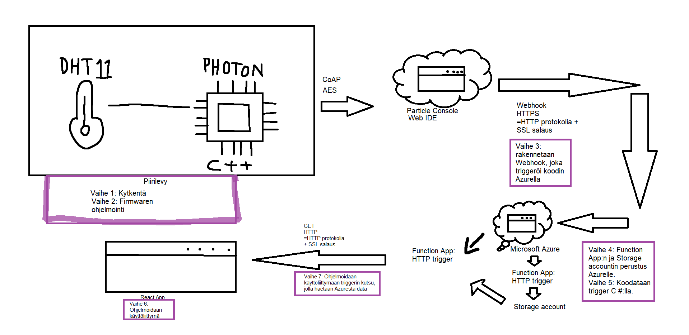
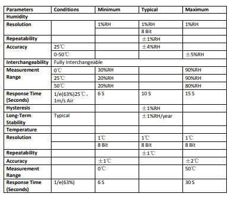
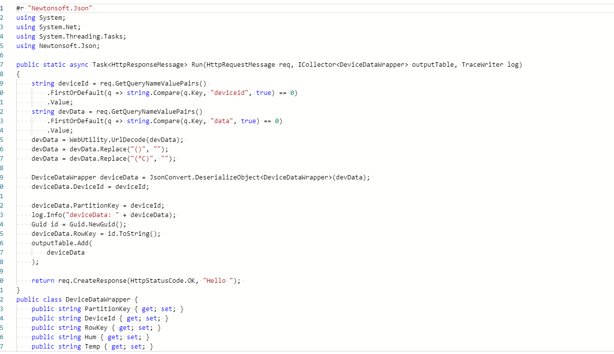
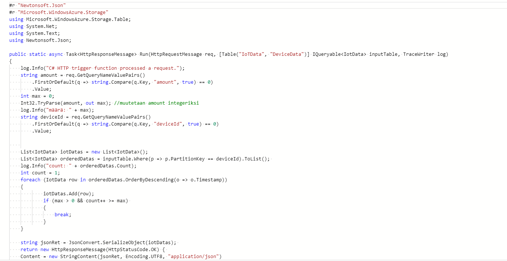

# IoT

## Mikä IoT?
*Lyhyesti se tarkoittaa laitteiden yhdistämistä internettiin. IoT:lla voidaan myös tarkoittaa järjestelmiä, jotka perustuu teknisten laitteiden automatisoituun tiedonsiirtoon, sekä sitä suorittavien laitteiden etäohjaukseen.
Esimerkiksi IoT kiinteistöhallinnassa: IoT mahdollistaa kiinteistön seurannan ja tarkkailun etänä. Kyseiset älykodit pystyvät myös lähettämään itsestään tietoa palveluille.*
## Sääasemajärjestelmän toimintakaavio
*-Anturi kerää jonkinlaista dataa. (Esim. kg, °C,)
 -Tietoliikenne, millä data viedään pilvipalveluun.
 -Pilvialustat mihin kerätty data laitetaan.
 -Analytiikka, millä hyödynnetään kerättyä dataa tavalla tai toisella.*

### Laitteistot
*-Particle Photonin kehityskortti muuttaa sähköisen suureen digitaaliseen muotoon. Firmware ohjelman ansiosta kehityskortin prosessori osaa kirjoittaa saamansa datan asteina ja prosentteina konsoliin, josta ne lähtevät Webhookilla eteenpäin. Photonin laiteohjelmisto kirjoitetaan Web IDE:llä.*
### Komponentit
*Particle Photon, DHT11 sensori, breakboard ja johtoja.*
### Anturit
*-Kuuleva anturi voi mitata äänenvoimakkuutta ja nykyään, jopa tunnistaa erilaisia ääniä. Esimerkkinä Hollannissa oleva anturi, joka mittaa ja osaa tunnistaa ihmisen agressiivisen ja kiihtyneen puheen, joka auttaa poliisipartioita tulemaan ajoissa paikalle.
-Tunteva anturi voi tunnistaa liikettä ja esimerkiksi kosteutta. Sillä voidaan myös tarkkailla ihmisten ja eläinten hyvinvointia. Esimerkiksi lehmään kytketty älysensori seuraa lehmän liikkuvuutta ja hännän heiluntaa. Tällä karjan kuolleisuutta voidaan vähentää 80 prosentilla. Myös rahtilaivoilla sensori on suuressa roolissa mittaamassa kosteutta.
-Haistava anturi mittaa esimerkiksi laivojen päästöjä pakokaasuvanoista ja koulujen sisäilmaa ja tunnistaa siinä ilmentyvää hometta.
-Näkevät anturit voivat tunnistaa liikettä. Niitä ovat esimerkiksi liiketunnistimet ja rahtikontin täyttöastetta tarkkailevat anturit. Täten anturi huomaa jos matkalla on hävinnyt tavaraa.*
#### DHT11
*-DHT11 on kosteutta ja lämpöä mittaava sensori.*

### Palvelut
  #### Sääasema käyttää Microsoft Azure pilvipalveluja.
  *-Hyötyjä: Joustava resurssien käyttö, luotettavuus
  -Haittoja: Pilvipalvelun tarjoaja voi nähdä tietosi ja tarjoajat näkevät, mitä teet ja voivat täten luoda sinusta profiilin.*
### Ohjelmointi
*-Käyttöliittymä ohjelmoidaan Reactilla: HTML, CSS ja Javascript.
-Particle Photonin koodi, joka hakee ja kerää datan:*

>#include <Adafruit_DHT_Particle.h>

>#define DHTPIN D0
>#define DHTTYPE DHT11

>double temperature;
>double humidity;

>int led = D6; 

>DHT dht(DHTPIN, DHTTYPE);

>// setup() runs once, when the device is first turned on.
>void setup() {
  
 > dht.begin();
  >Particle.variable("temperature", temperature);
  >Particle.variable("humidity", humidity);
  >pinMode(led, OUTPUT); 
  
   >Particle.function("led",ledToggle);
  
  >digitalWrite(led, LOW);

 
  
  >Particle.subscribe("hook-response/temperatureSaku", myHandler, MY_DEVICES);
  
>}

>// loop() runs over and over again, as quickly as it can execute.
>void loop() {

  >float h = dht.getHumidity();
  >float t = dht.getTempCelcius();
  >temperature=t;
  >humidity=h;

  >if(isnan(h) || isnan(t)) {
    >Serial.println("Failed to read from DHT sensor!");
    >return;
  >}
  
  >//String data = String(10);
  >String data = String::format("{\"Hum(\%)\": %4.2f, \"Temp(°C)\": %4.2f, \"DP(°C)\": >%4.2f, \"HI(°C)\": %4.2f, \"Light\": %d}", h, t);
  >// Trigger the integration
  >Particle.publish("temperatureSaku", data, PRIVATE);
  
  >delay(6000);

>}

>int ledToggle(String command) {

   > if (command=="on") {
        >digitalWrite(led,HIGH);
       > return 1;
    >}
    >else if (command=="off") {
        >digitalWrite(led,LOW);
        >return 0;
    >}
    >else {
        >return -1;
    >}
}
>void myHandler(const char *event, const char *data) {
 > // Handle the integration response
>}
          

*-CSharp 1 tallentaa anturin datan tietovarastoon:

-CSharp 2 rakentaa tallennetusta datasta JSON rajapinnan:*

### Käyttöliittymä Azurella
*-Käyttölittymä on tehty Reactilla, joka työntää datan Azuren Static Web Appiin.*
## Käytetyt kehitysympäristöt
*Microsoft Azure, Replit, GitHub*
## Termihakemisto
*-Protokolla: Määrittelee tai mahdollistaa laitteiden tai ohjelmien väliset yhteydet.
-Web IDE: Integrated Development Environment
-HTTPS: Hypertext Transfer Protocol Secure
-CoAP: Constrained application protocol
-AES: Advanced Encryption Standard*
## Lähteet
#### Anturit: 
*-https://www.dna.fi/yrityksille/aistien-internet-podcast*
#### DHT11: 
-*https://www.mouser.com/datasheet/2/758/DHT11-Technical-Data-Sheet-Translated-Version-1143054.pdf*
#### IOT: 
-*https://youtu.be/2p7V_6WzVOw?list=PLtbOrywM-BA8qzTn5fkzhlcaR3d92HYO7
-https://youtu.be/nzg_x1-EFpc?list=PLtbOrywM-BA8qzTn5fkzhlcaR3d92HYO7*